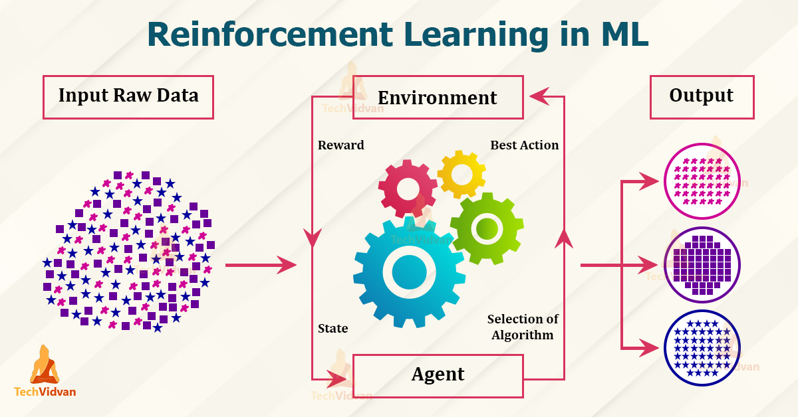
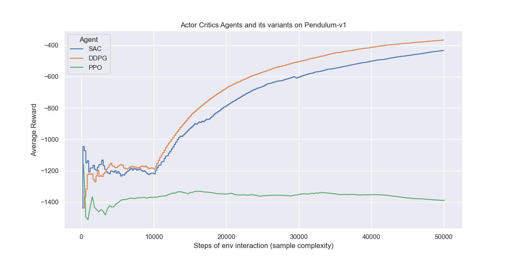
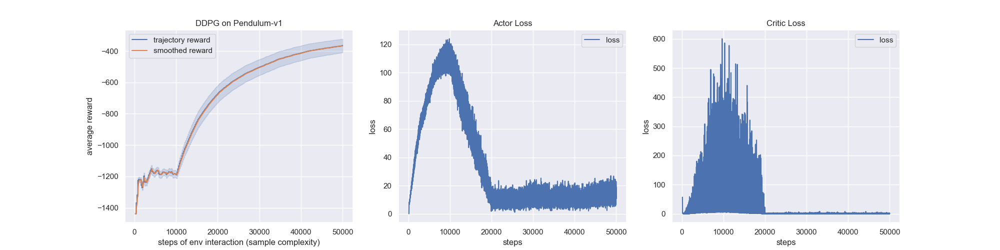
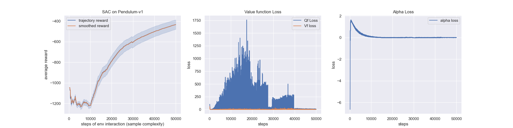
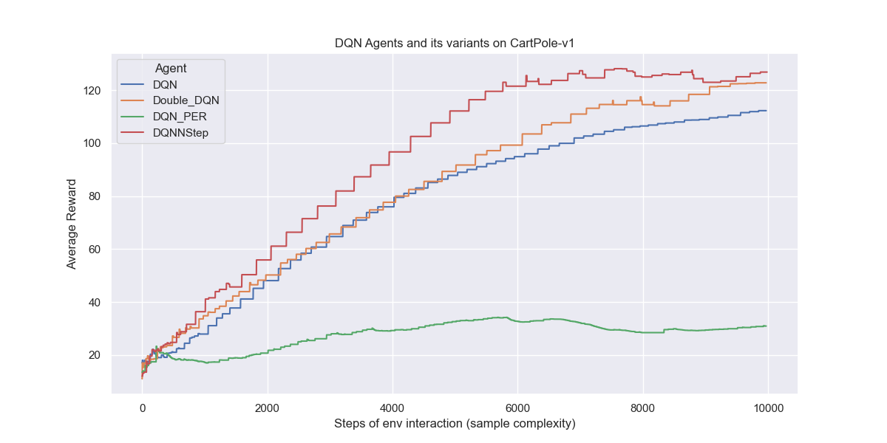
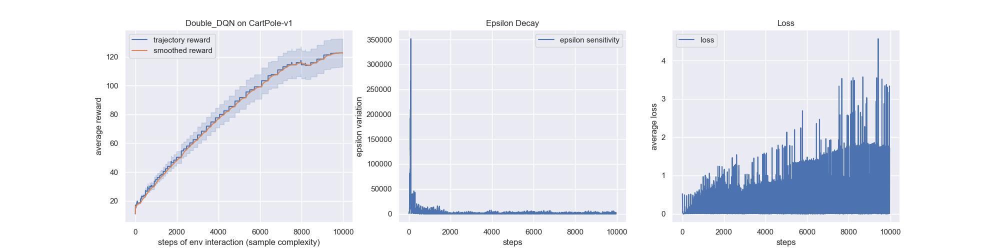
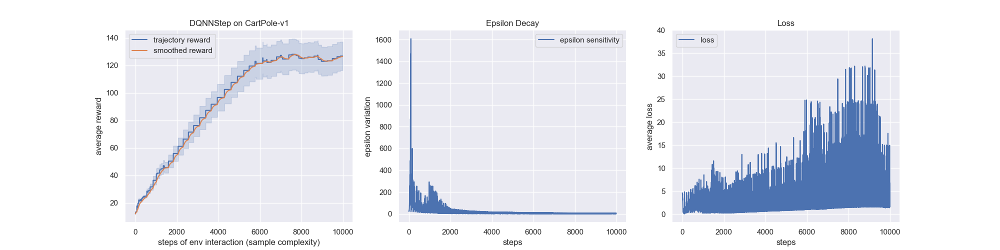

# Deep-Reinforcement-Learning-Optimal-Control
This repository contains PyTorch implementations of deep reinforcement learning algorithms and environments for Robotics and Controls. 
The goal of this project is to include engineering applications for industrial optimization.
I reproduce the results of several model-free and modelbased RL algorithms in continuous and discrete action domains.


[](https://github.com/dwyl/esta/issues)


 


Here a curated article list of the algorithm implemented

## **Algorithms Implemented**  

1. *Deep Q Learning (DQN)* <sub><sup> ([Mnih et al. 2013](https://arxiv.org/pdf/1312.5602.pdf)) </sup></sub>  
1. *DQN with Fixed Q Targets* <sub><sup> ([Mnih et al. 2013](https://arxiv.org/pdf/1312.5602.pdf)) </sup></sub>
1. *Double DQN (DDQN)* <sub><sup> ([Hado van Hasselt et al. 2015](https://arxiv.org/pdf/1509.06461.pdf)) </sup></sub>
1. *DDQN with Prioritised Experience Replay* <sub><sup> ([Schaul et al. 2016](https://arxiv.org/pdf/1511.05952.pdf)) </sup></sub>
1. *Dueling DDQN* <sub><sup> ([Wang et al. 2016](http://proceedings.mlr.press/v48/wangf16.pdf)) </sup></sub>
1. *REINFORCE* <sub><sup> ([Williams et al. 1992](http://www-anw.cs.umass.edu/~barto/courses/cs687/williams92simple.pdf)) </sup></sub>
1. *Deep Deterministic Policy Gradients (DDPG)* <sub><sup> ([Lillicrap et al. 2016](https://arxiv.org/pdf/1509.02971.pdf) ) </sup></sub>
1. *Twin Delayed Deep Deterministic Policy Gradients (TD3)* <sub><sup> ([Fujimoto et al. 2018](https://arxiv.org/abs/1802.09477)) </sup></sub>
1. *Soft Actor-Critic (SAC)* <sub><sup> ([Haarnoja et al. 2018](https://arxiv.org/pdf/1812.05905.pdf)) </sup></sub>
1. *Soft Actor-Critic for Discrete Actions (SAC-Discrete)* <sub><sup> ([Christodoulou 2019](https://arxiv.org/abs/1910.07207)) </sup></sub> 
1. *Asynchronous Advantage Actor Critic (A3C)* <sub><sup> ([Mnih et al. 2016](https://arxiv.org/pdf/1602.01783.pdf)) </sup></sub>
1. *Syncrhonous Advantage Actor Critic (A2C)*
1. *Proximal Policy Optimisation (PPO)* <sub><sup> ([Schulman et al. 2017](https://openai-public.s3-us-west-2.amazonaws.com/blog/2017-07/ppo/ppo-arxiv.pdf)) </sup></sub>
1. *DQN with Hindsight Experience Replay (DQN-HER)* <sub><sup> ([Andrychowicz et al. 2018](https://arxiv.org/pdf/1707.01495.pdf)) </sup></sub>
1. *DDPG with Hindsight Experience Replay (DDPG-HER)* <sub><sup> ([Andrychowicz et al. 2018](https://arxiv.org/pdf/1707.01495.pdf) ) </sup></sub>
1. *Hierarchical-DQN (h-DQN)* <sub><sup> ([Kulkarni et al. 2016](https://arxiv.org/pdf/1604.06057.pdf)) </sup></sub>
1. *Stochastic NNs for Hierarchical Reinforcement Learning (SNN-HRL)* <sub><sup> ([Florensa et al. 2017](https://arxiv.org/pdf/1704.03012.pdf)) </sup></sub>
1. *Diversity Is All You Need (DIAYN)* <sub><sup> ([Eyensbach et al. 2018](https://arxiv.org/pdf/1802.06070.pdf)) </sup></sub>

All implementations are able to quickly solve Cart Pole (discrete actions), Mountain Car Continuous (continuous actions), 
Bit Flipping (discrete actions with dynamic goals) or Fetch Reach (continuous actions with dynamic goals). 

I plan to add more RL algorithms related to engineering process.

## **To do: Environments to be Implemented as a next stage**

1. *Bit Flipping Game* <sub><sup> (as described in [Andrychowicz et al. 2018](https://arxiv.org/pdf/1707.01495.pdf)) </sup></sub>
1. *Four Rooms Game* <sub><sup> (as described in [Sutton et al. 1998](http://www-anw.cs.umass.edu/~barto/courses/cs687/Sutton-Precup-Singh-AIJ99.pdf)) </sup></sub>
1. *Long Corridor Game* <sub><sup> (as described in [Kulkarni et al. 2016](https://arxiv.org/pdf/1604.06057.pdf)) </sup></sub>
1. *Ant-{Maze, Push, Fall}* <sub><sup> (as desribed in [Nachum et al. 2018](https://arxiv.org/pdf/1805.08296.pdf) and their accompanying [code](https://github.com/tensorflow/models/tree/master/research/efficient-hrl)) </sup></sub>

## **Results**

#### 1. Environements: CartPole and Pendulum for Classic Control and Robotics

Below shows various RL algorithms successfully learning discrete action game [Cart Pole](https://gym.openai.com/envs/#classic_control)
 or continuous action game [Pendulum](https://gym.openai.com/envs/#classic_control). We record the average result from running the algorithms 
 with 3 random seeds is shown with the shaded area representing plus and minus 1 standard deviation. Hyperparameters
 used can be found in files `results/Cart_Pole.py` and `results/Pendulum.py`. 
 


#### 2. Policy Gradients Algorithm Experiements

Below shows the performance of Actor Critic models such as DDPG, PPO, SAC and TD3 including learning acceleration methods using demonstrations for treating real applications with sparse rewards. 

The results replicate the results found in the papers. In the next stage, I plan to show how adding HER can allow an agent to solve problems that it otherwise would not be able to solve at all. Note that the same hyperparameters were used within each pair of agents and so the only difference between them was whether hindsight was used or not. 

 
 
 


#### 3. DQN Learning Algorithm Experiments

The results of DQN's show how we could avoid instable or even divergent nonlinear function approximator presented in the action-value Q function. The instability is more often caused by the presence of correlation in the sequence of observations, [DQN](https://storage.googleapis.com/deepmind-media/dqn/DQNNaturePaper.pdf) suggest two key ideas to address these instabilities with a novel variant of Q-learning: Replay buffer and Fixed Q-target.

The results replicate the results found in the papers for DQN, DoubleDQN, PrioritizedExperienceReplay and N-stepLearning. 


 
 

     

### Usage ###

The repository's high-level structure is:
 
    ├── agents                    
        ├── Actor_critics  
            ├── Base_agent
            ├── A2C_Agent
            ├── DDPG_Agent
            ├── PPO_Agent
            ├── SAC_Agent
        ├── DQN         
            ├── Base_agent_DQN
            └── DQN_Agent
            └── DQN_PER_Agent
            └── DoubleDQN_Agent
            └── DQNNStep_Agent
    ├── environments   
    ├── tests
        ├── Cart_pole
        ├── Pendulum             
        └── data_and_graphs        
    ├── utilities             
        └── Replay_Buffer
        └── Actor_Critics_utilities
            └── A2C
            └── DDPG
            └── PPO
            └── SAC
            └── TD3
        └── Actor_Critics_utilities    
            └── DQN_Network
            └── Prioritized_Replay_Buffer
            └── Replay_Buffer_NStep
            
        
   

#### i) To watch the agents learn the above games  

To watch all the different agents learn Cart Pole follow these steps:

```commandline
git clone https://github.com/vincehass/Arctic-Deep-Reinforcement-Learning-Benchmark.git
cd Deep_RL_Implementations

conda create --name myenvname
y
conda activate myenvname

pip3 install -r requirements.txt

python test/Cart_Pole.py
``` 

For other games change the last line to one of the other files in the test folder. 

#### ii) To train the agents on another game  

Most Open AI gym environments should work. All you would need to do is change the config.environment field (look at `Results/Cart_Pole.py`  for an example of this). 

You can also play with your own custom game if you create a separate class that inherits from gym.Env. See `Environments`
for an example of a custom environment and then see the script `test` to see how to have agents play the environment.